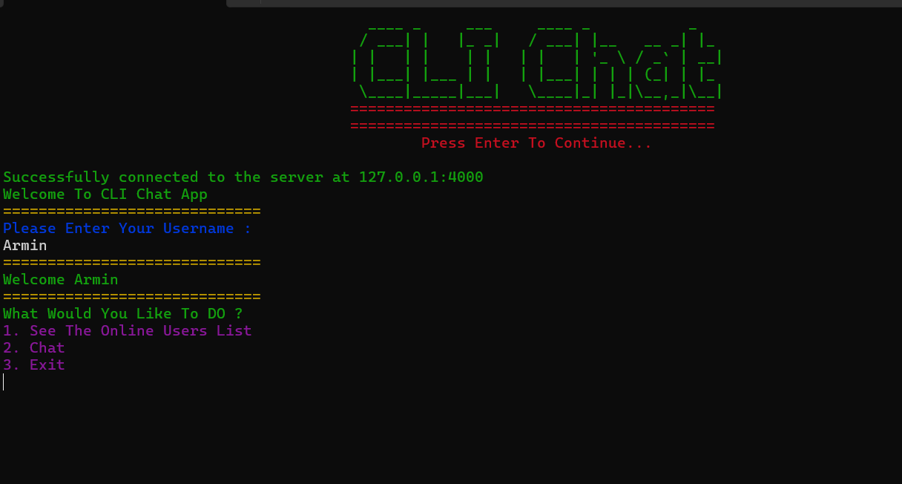

# CLI Chat Application

Welcome to the CLI Chat Application! This project implements a very simple chat server and client using C++ and Boost.Asio for asynchronous I/O. Users can register, send messages, and see who is online in real-time.

## Features

- **Asynchronous Communication**: The server and client use Boost.Asio for non-blocking I/O operations.
- **User Registration**: Users can register with a unique username.
- **Broadcast Messaging**: Send messages to all connected users.
- **Direct Messaging**: Send direct messages to specific users.
- **Real-Time User List**: See who is online in real-time.

## Screenshots

### Client Main Menu



## Getting Started

### Prerequisites

- Boost C++ Libraries

### Running

1. **Start the server**:

   ```bash
   ./server
   ```

   You should see a message indicating that the server is running on port 4000.

2. **Run the client**:

   ```bash
   ./client
   ```

   Follow the on-screen instructions to register a username and start chatting!

## Usage

### Client Options

1. **See Online Users**: Displays the list of currently online users.
2. **Chat**: Send messages to other users. You can type `Back` to return to the main menu while in chat mode.
3. **Exit**: Disconnect from the server.

### Logging

The server logs all important events, such as user connections, disconnections, and message broadcasts, to the console.

### Server

```plaintext

Server is running on port 4000
[LOG] User Alice has connected
[LOG] User Bob has connected
[LOG] Message from Alice: Hello!
```
